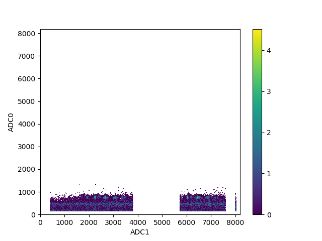

# lstpy
[](https://travis-ci.org/fujiisoup/lstpy)

A small library to read output files MPA3 / MPA4 system **lst** file.
lstpy is full-python code but thanks to `numba` and multi-threading, the readout is fast enough.

# Install

```
pip install lstpy
```

# Requirements

lstpy requires [numba](https://numba.pydata.org/numba-doc/dev/index.html)
and [numpy](https://docs.scipy.org/doc/).
Anaconda distribution might be the easiest way to install them.

```
conda install numba
conda install numpy
```

[xarray](https://xarray.pydata.org) is an optional dependency, but the use of
xarray greatly simplifies the further analysis.

# Usage

## Basic usage

```python
import lstpy

header, (values, time, ch, events) = lstpy.load(filename)
```

or with xarray, you can get a single object

```python
>>> import lstpy
>>> lstpy.load_xr(filename)

<xarray.DataArray (ch: 2, events: 28991)>
array([[8191, 2679, 1431, ..., 2102, 1491, 1635],
       [ 973,  973,  973, ..., 4379, 4380, 4381]], dtype=uint16)
Coordinates:
  * ch       (ch) uint64 2 3
  * events   (events) uint64 1 2 3 4 5 6 ... 30141 30142 30143 30144
    time     (events) uint32 15 163 196 223 311 ... 409913 409940
Attributes:
    ctm:          400
    ...
```


## More practical usage

Load a list file and construct a histogram.

```python
>>> import lstpy
>>> import numpy as np
>>> da = lstpy.load_histogram('test_public/data/Neon_KLL_002.lst', n_bins=2)
>>> da

<xarray.DataArray (ADC0: 1024, ADC1: 1024)>
array([[0., 0., 0., ..., 0., 0., 0.],
       [0., 0., 0., ..., 0., 0., 0.],
       [0., 0., 0., ..., 0., 0., 0.],
       ...,
       [0., 0., 0., ..., 0., 0., 0.],
       [0., 0., 0., ..., 0., 0., 0.],
       [0., 0., 0., ..., 0., 0., 0.]])
Coordinates:
  * ADC0     (ADC0) float64 4.0 12.0 20.0 28.0 ... 8.172e+03 8.18e+03 8.188e+03
  * ADC1     (ADC1) float64 4.0 12.0 20.0 28.0 ... 8.172e+03 8.18e+03 8.188e+03

>>> np.log(da).plot()
```



This is equivalent to
```python
>>> data = lstpy.load_xr('test_public/data/Neon_KLL_002.lst')
>>> da = lstpy.utils.histogram(data, n_bins=2)
```

## Q&A

- Sometimes lst file is corrupted and cannot read

Try disabling multiprocessing, by setting `chunk=None`, 
```python
lstpy.load_xr('test_public/data/Neon_KLL_002.lst', chunk=None)
```


# Constribution

Not all the features of MPA system are not yet supported. Contributions are welcome.
If you have any questions or request, raise an issue at Github issue page.
